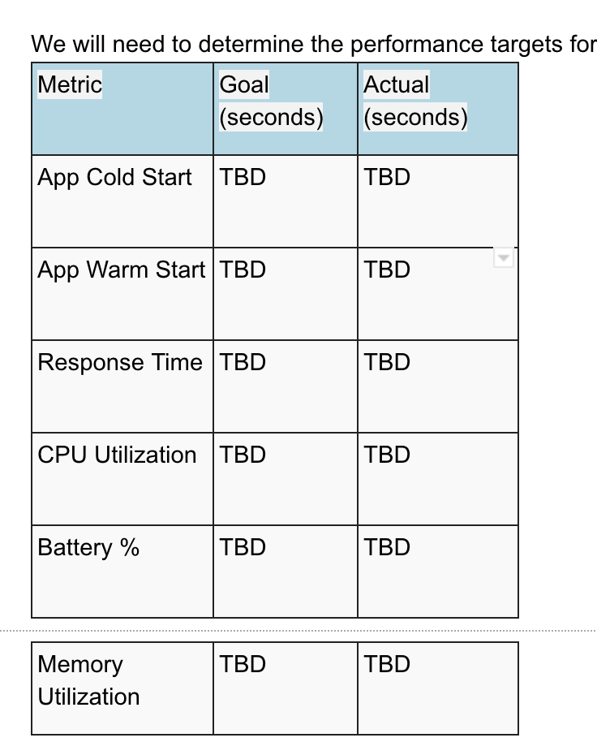

# Test Ideas for Mobile Testing
- Test Idea Functional and Non-Functional Testing in Mobile App
 
 
 
 

## Here are the device specific scenarios that that should be covered as part of any feature test sign off on mobile website:
 
 
 
 

- **Latency**: Latency is the time taken by the application to complete any action.

 
 
 
 

- **Responsiveness**: Responsiveness of an app is the time taken to respond for a user input. 

 
 
 
 

- **Smoothness**: Smoothness of an application refers to the smoothness of graphics rendering and responsiveness offered to the users. It is measured in terms of FPS (Frames per Second). Steady and consistent 30 FPS would offer smooth user experience when compared to random FPS values.

 
 
 
 

- **Gestures**: Validation of all gestures like touch, pinch, and zoom as defined in mocks on a real device from low end to high end range of devices supported.

 
 
 
 

- **UI Layout**: Validate that UI layout and rendering on a real device should map to exactly what was defined in the mocks

 
 
 
 

- **Unrecoverable workflows**: We need to make sure that in any workflow of browsing mobile app should not lead to a 404 page. One of the most common examples in this case would be back button behavior (both soft and hard keys) on pages. This would also require testing of scenarios for history and cache management and it will become super critical to run.[Product  problem]

 
 
 
 

- **Redirection**: There are features in the mobile website and app that will have the user switch context to a different page. In those flows, we need to ensure both forward and backward workflows. 

 
 
 
 

- **Conflicts**: Some of the conflicts that will need to be verified on a real device are:
1. Conflicts/Interrupts (Only on app)
2. Pause and launch music/movie player
3. Pause and launch camera
4. Pause and launch another app
5. Low battery when using app[Need to fix, not super Critical]
6. Plug/unplug USB when using app
7. Change USB connection when using app
8. Close/lock screen and open when using app
9. Close mobile before quit app
10. Minimize app to status bar and launch it
11. Switch to another app then launch this app again from status bar

 
 
 
 

## Network Connectivity
- We need to validate our website with different networking conditions ranging from WI-FI to  3G,, and etc. on varying network conditions so say WI-FI, 2G, 3G., lost network etc. Here are the top scenarios that will need to be run :
1. Wi-Fi
2. Cellular
3. Offline
4. Lost network
5. Lost connectivity
6. Network transition from Wi-Fi to cellular and vice-versa
7. Network variation/Bandwidth throttling

 
 
 
 

## Performance Benchmarking (Only on app)
- This includes identifying toolset which can enable testers to run battery consumption, memory consumption and CPU utilization on both first and subsequent starts (cold vs warm launch)
1. Battery consumption
2. Memory consumption
3. Storage and Working Memory Usage/Operation
4. UI Response/Load

 
 
 
 

## Crash Reports Integration
- This includes validating that if a crash happens in production, we need to make sure that the crash report was sent to analytics.

 
 
 
 

## Tracking Reports

 
 
 
 

## Api test 

 
 
 
 

## Battery Historian: 
- https://github.com/google/battery-historian

 
 
 
 

## Stress test 
- To ensure the App’s robustness and stability, we will plan individual two rounds of stress tests 
    1.Two rounds tests to ensure no stress regression.
    2.Sanity test automation will be used to run in a recursive fashion to generate stress numbers.
    3.Both Debug and Release build will be introduced into stress test, which provide more useful information to dev team.
    4.Stress test will be introduced in regression to ensure no stress side effect.

## Performance Targets

## Launch Test 

## Beta Test
- Beta build should be released by following Google Play Beta release process. Internal users who are in beta user group will receive the Beta build link. After 5 days of Beta test, we will receive data on bugs, crashes and general feedback which will help us in GoNoGo decision of the App.

## Post Launch Tests
- This will be covered once the app is live and metrics gets generated. This will automatically include real prod traffic, from every part of the country where the app is downloaded along with their varying network bandwidths, carriers etc.We will continue to capture the latency metrics for different screens for the basic flow

## Upgrade testing: 
- This will come into the picture only after we have launched one version of the App. This is really important as generally we get a lot of poor customer reviews because of the issues with updates to Apps. 
